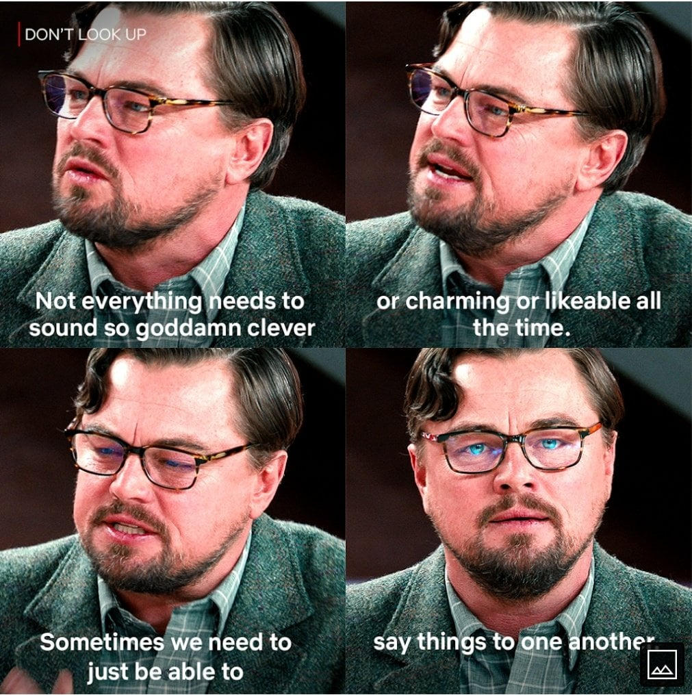

Just watched Netflix's new "Don't Look Up" last night, and it is by far the most relevant movie of our time.

To me the movie isn't so much about climate change or science as it is about communication. Today's world is a mess of social medias, dwindling news sources, increasingly complex issues, and infinite amounts of tiktok videos, all fighting for your limited attention and cognition, all interested in generating noise than signal. In this mad world, how do we simply get a point across, reach common ground, and pay attention to the important things that matter? If we can't even figure this out, where do we even start?

The sad part is this movie isn't even "absurd" or "satire", it is a very pointed portrayal of the real world out there, and a moderate one at it. As the director said himself: "It was already a crazy script but I would say reality out-crazied us by like 10 to 15%. Well done, reality."

