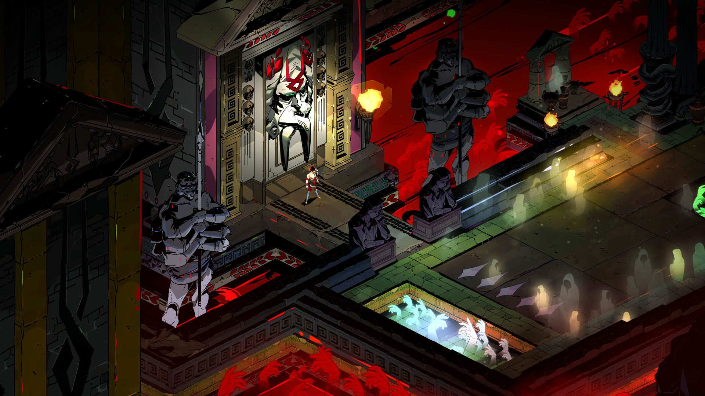

The latest game from my favoritest studio, [Hades](https://www.supergiantgames.com/games/hades/), is a refined culmination of their craft: impeccable stunning artwork, epic cinematic soundtrack, tight crispy combat, tough-as-nails gameplay, lovingly written characters, and finally a wonderful touching story at the center.

[Supergiant Games](https://www.supergiantgames.com/)' previous titles all tell of a memorable touching story. With such a precious piece of artwork, for me, is something to be played once, experienced once, something to commit as a beautiful memory, not to be replayed.

However, at the core, what sets _Hades_ apart is its _replayability_. It is here that the devs did something novel. They created a roguelike game, intentionally repetitive in nature. However, unlike the usual formula of using mechanics as the reward (like unlockable items or skills), _Hades_ instead uses _story as the reward_.

In this novel manner, they carry out their signature character-based story-telling. In this manner, they've created their most replayable game yet: keeping the player coming back, grinding, replaying the levels over and over, just to get a little further, just to learn a little more about this character, who are they, what happened to them, and why are they here?

Moreover, they've ingeniously chosen the rich world of Greek mythology as the setting for this cyclical mechanic: the main character, born of gods, is immortal, unable to die, and therefore forced to relive death over and over as the player fails to escape.

This is Supergiant's trademark: their ability to craft a _complete_ game. By that I mean, a game where no aspect is lacking, nor is any aspect shining brighter than the rest. Whether it is art, music, gameplay, or writing, they are each so strong on their own, but when woven together, becomes something so powerful, so immersive, so beautiful and memorable, a complete experience.

And for _Hades_, unlike its predecessors, this experience does not end. This game has been my place of comfort in 2020. I have a place here now, in the House of Hades, where I can always come back, hang out with my immortal friends and family, and to do that "one more run".
