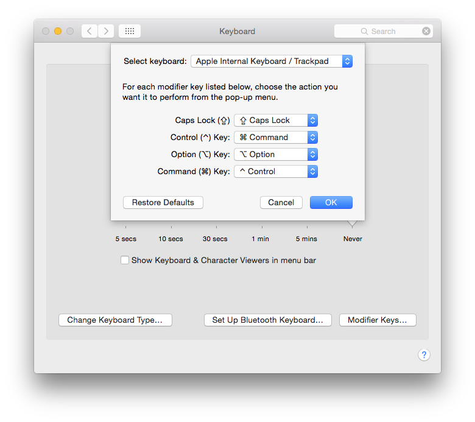
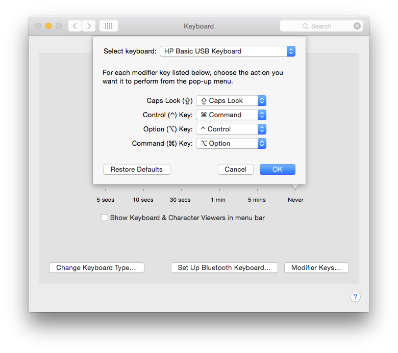
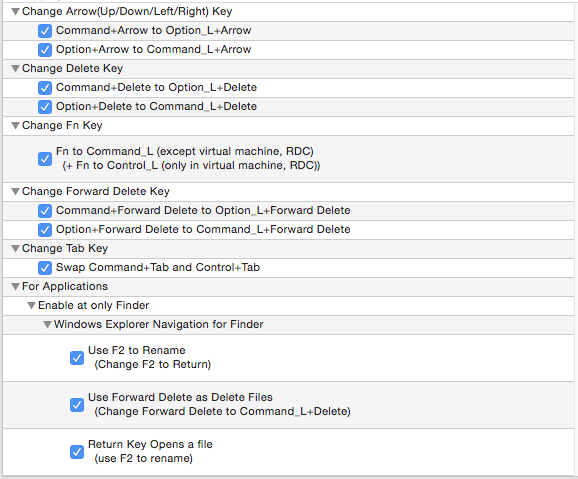
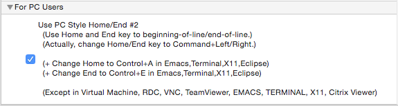
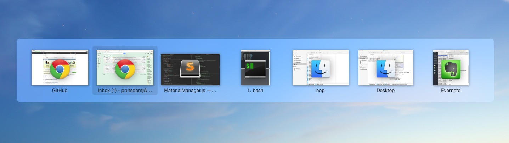
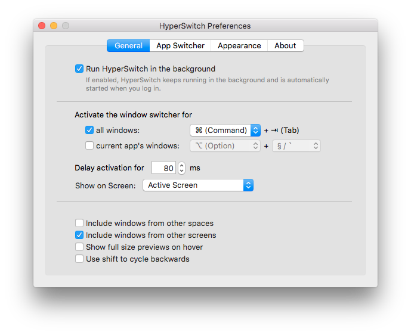

I've been a Windows user all my life, but I have to admit, Macs are great computers. The hardware is absolutely gorgeous, and the software experience is cohesive and smooth. They also make a great development environment thanks to the Unix system. (There are of course many other things to say about Macs, but I'll let the fanboys sing the praise.)

When I was presented with the choice of Mac or Windows at my new job, I bit the bullet and took a Mac. I said "bit the bullet" because despite all the things I said, **I absolutely hate Mac keyboard shortcuts.** I simply cannot deal with the ⌘. Why am I hitting hotkeys with my thumb when it's supposed to be at home resting on the spacebar? And what is that Fn key doing in the bottom left corner, one of the most valuable spots on the keyboard? Also, why does hitting Enter on a file rename it instead of opening it? I can go on. I'm sure the smart folks at Apple could easily fix some of these, but for the sake of being different, they have to have it their way. Such is marketing.

So, for the past couple weeks, I've embarked on a journey to make my Mac behave more sensibly like Windows. And recently, I've reached a point where I feel like I have triumphed, and I would like to share some of those findings.

Here we go.

# How to Use Your Mac like Windows

## First Things First

Do it. Swap those Cmd and Ctrl keys.

If you're using a Windows keyboard, your settings will instead look like this:

## Karabiner

Link: https://pqrs.org/osx/karabiner/

This is where the magic happens. This is a powerful tool to remap your keyboard, and we'll be using this to map most things to the Windows style. (Technically, the Cmd and Ctrl swap from above can be done here as well, but I was having issues when I tried it and not all mappings work as expected.) Here is my setup:

This gives you:

- Windows style **hotkeys with Ctrl** instead of Cmd
- For Macbooks, Fn key behaves like Ctrl
- **Windows style Alt+Tab** to switch windows. I'm using the physical location of the key to mimic this behavior, so the mapping is different for Mac vs Windows keyboards. See above.
- **Enter** to open files
- **Delete** to delete files. Only on keyboards with Delete key, not Backspace. So on a Macbook you'd still have to do Cmd+Backspace (well, Ctrl in this case).
- **F2** to rename files
- Text Editing: this is crucial if you write code!
  - **Ctrl+Arrows/Delete/Backspace** does entire-word operations
  - **Windows style Home/End** behavior, takes you to beginning/end of line. Normally, Mac Home/End takes you to beginning/end of file.

## BetterTouchTool

Link: https://folivora.ai/downloads

For the window "snapping" behavior introduced in Windows 7 (originally called Aero Snap.) There are a lot of options out there but this is just one I found to work well and it's free!

## HyperSwitch

Link: https://bahoom.com/hyperswitch

Mac "Alt+Tab" behavior switches you between apps, and all windows of that app. So, for example, you can't quickly switch to just one Finder window without bringing out 50 other ones that are open. This app switcher alternative fixes that and allows switching between individual windows. Install it and map the key to Cmd+Tab, replacing the Mac default.

For reference, here's a screenshot of the settings I use.

## XtraFinder

Link: https://www.trankynam.com/xtrafinder/

As a bonus, here's a plugin for your Finder that will give it superpowers! There's tons of features here to play with, but the most important one in this context is the ability to "Arrange folders on top"! Hooray!

And that's it with my setup. This is in no way perfect, and I'm sure there are other ways to do it and other apps to add. But so far it's been working pretty well, and definitely makes using my Mac a whole lot more enjoyable.

I hope you find this useful too!
