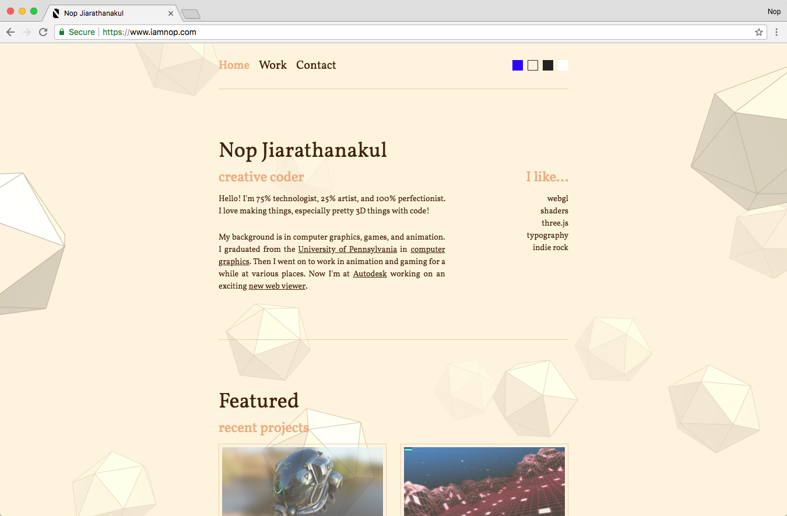

This post marks the launch of a new long overdue website!

I released my current website at https://www.iamnop.com/ a long time ago, but it was practically a placeholder with almost no content. Now I've rebuilt it from the ground up with [React](https://reactjs.org/) and a powerful site generator [Gatsby](https://www.gatsbyjs.org/).

It took me a good while (a month or so) to finally complete this project, as I was learning a lot of new libraries along the way. I was also being a smartypants and jumped ahead to Gatsby v2, which is still in beta. I ended up writing and rewriting a lot of throwaway code as the beta still had a ton of moving parts and bugs. However, the Gatsby community is very active and has been very helpful in helping me get through the blockers. Thanks guys!

I will probably be writing more about the development process later. In the meantime, if you're curious you can check out the code on Github: https://github.com/nopjia/gatsby-blog
