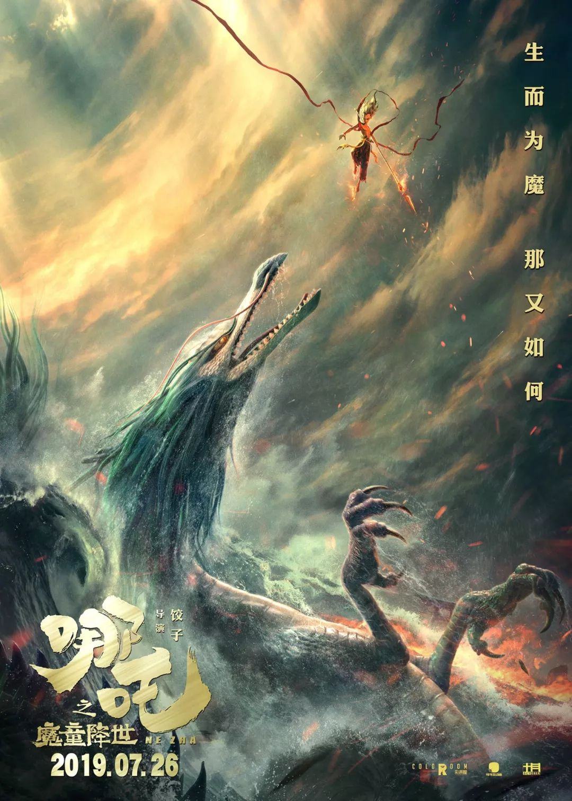

Went to see the Chinese animated film, _Ne Zha_, as I heard a few friends mention it. Honestly went in with rather low expectations, but oh boy, was I wrong!

_Ne Zha_ was an action-packed 2 hours of pure fun, epic VFX sequences, and some candidly funny moments. But more than anything, it is a Chinese film made by Chinese. As _Ne Zha_ is based on a prominent Chinese mythical character, it brings me back to my childhood watching fantasy drama on local TV. It brings many of those familiar themes to the big screen, and along with it, Chinese sensibilities and values such as Taoism and filial piety.

The most surprising part to me was the story! I am one who tends to think that despite their grand production value, most big time Chinese films often lack story. However, the story in _Ne Zha_ more than exceeds the standards of an animated film. It grapples well a complex central theme, it has no clear good vs evil, and characters received enough development such that you understand their motives.

Finally, how was the animation? It was great! No, it's no Disney, but it's pretty darn close. And oh my god, the animated Chinese mythical characters and settings were absolutely gorgeous!

I was so thoroughly pleasantly surprised. It is definitely a milestone for the Chinese animation industry. And I can't wait for more.
