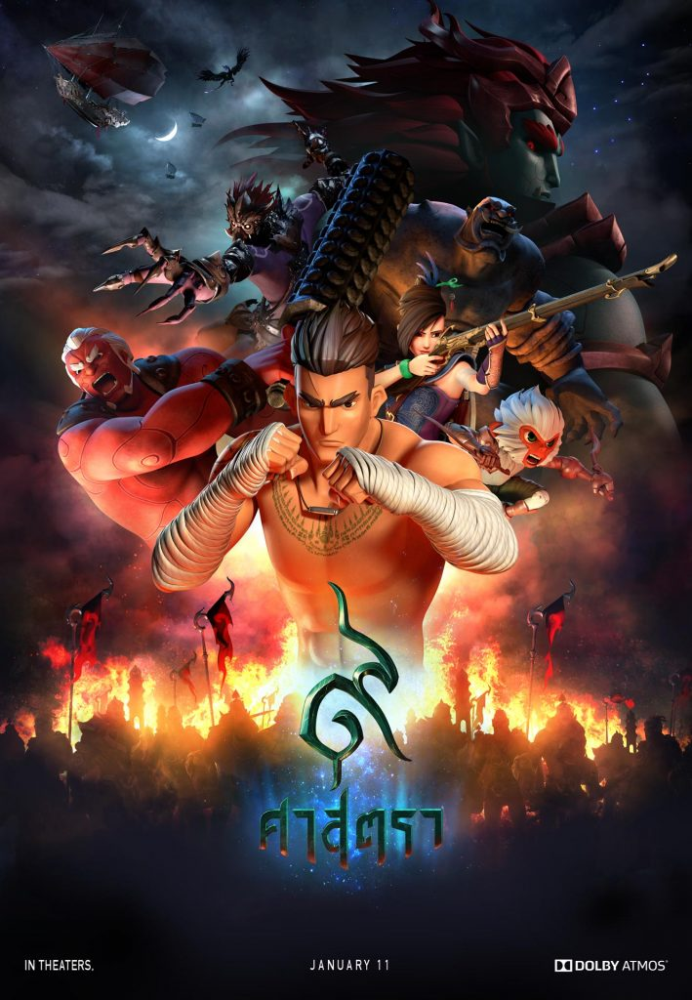

Caught the very last showing of [9 Satra](http://www.9satramovie.com/) yesterday, and oh my god am I glad I did. This movie exceeded all my expectations.

Action-packed fast-paced storytelling that constantly has you at the edge of your seat. Lovable fully developed side characters with their own legitimate backstory. A rich and vast world that is practically a fantasy version of Thailand. Halfway in as heroes embark on the adventure, you get a sense of excitement that it'll be so much fun you don't want it to end!

All the while there was an undeniable Thai-ness, but was not cheesy or oversold, as it was part of the story and supported the story. For example, the iconic Koh Tapu was our hero's home, and the tradition of Nang Talung was used for the 2D montage. Both are from the South, the birthplace of the ancient martial art form of Muay Thai Chaiya (not to be confused with the modern sport.)

Which brings us to the best part, the Muay Thai, which was paid full respect in this movie. All the movements, the forms, fighting style throughout the movie were right on point! Being a huge martial arts fan and having practiced some Muay Chaiya myself, seeing this sacred art form come to life in a fantasy animation film was a dream come true. All those beautiful forms that I learnt by their (epic!) names being used in full force by a superhero along with his lovable friends to defeat mythological-level bad guy in fantasy-Thai-land is just _PURE AWESOME_. All this really resonated personally, and is the real reason I loved the movie so much.

Yes the animation could be smoother, shading could be better, and they could use more motion blur, but if you can overlook the technical flaws, I'd give everything else a 10/10!

Super impressed. Loved loved loved it. I am so proud to be born Thai. ❤️🇹🇭
