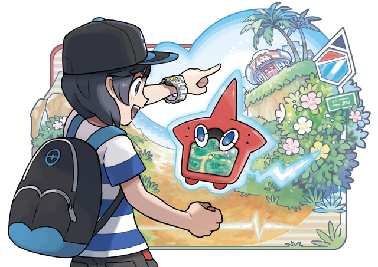

People have been asking why I'm not playing [Pokémon Go](https://www.pokemongo.com/). And after a few discussions like this, I decided to write a little post.

The core Pokémon game is about training your Pokémon, leveling them up, learning new moves, evolving, and forming the perfect team. The result is you form a special bond with your Pokémon since you spent so much time with them that you even feel bad when you put one of your mains in the PC! This is the core essence that makes Pokémon so special and dear to our hearts.

Pokémon Go is basically a stripped down version of [Ingress](https://www.ingress.com/), where our beloved Pokémon are reduced to mere commodity. Here, you walk around, collect a dozen Zubats, once you have enough you then "dust" them and turn them into something better. This is a core loop of a card battle game with their hundreds of Chinese knockoffs. The familiar turn-based battle system is instead replaced with a mash-your-finger-at-the-screen-until-someone-dies that is common to a lot of mobile battle games. Unlike Ingress which has a truly unique and engaging location based core loop, Pokémon Go is but a shadow of its precursor with a bunch of mobile-gamey type gimmicks thrown together to artificially keep users engaged and paying.

The original Pokémon game is already perfect as a location based game: patches of tall grass, water, gyms, PokéCenters and PokéMarts. Sure there might have to be a few tweaks if you want a faster paced game to encourage walking, if that is the goal. But why completely reinvent the game when you already have something that has been tried and tested for two decades?

As one of the biggest Pokémon fans, I couldn't be more excited for Pokémon Go. It had so much potential. Not only is this the [Pokémon MMO](https://pokemmo.eu/) we've all been waiting for, it is an opportunity for us all to finally live out our childhood dreams in the real world.

Yes, I understand Niantic is a small company trying to turn this around in a couple of years, but to be given half-assed of a mobile game with the official Pokémon brand, I feel almost betrayed. This should've been a 5-10 year project, a joint effort, but mainly overseen by the devs at Gamefreak, with decades of expertise churning out polished game after game. Nintendo was desperate to enter the mobile market, and Go was their savoir. In my opinion, they should've protected their brand better and made a more complete of a game. But seeing how successful Go was, I am happy for them and what it means for the continued popularity of Pokémon. Pokémon is truly a part of my childhood, and for someone like me, I hope that Pokémon Go's tremendous success will someday lead to that game I've been wishing for.
