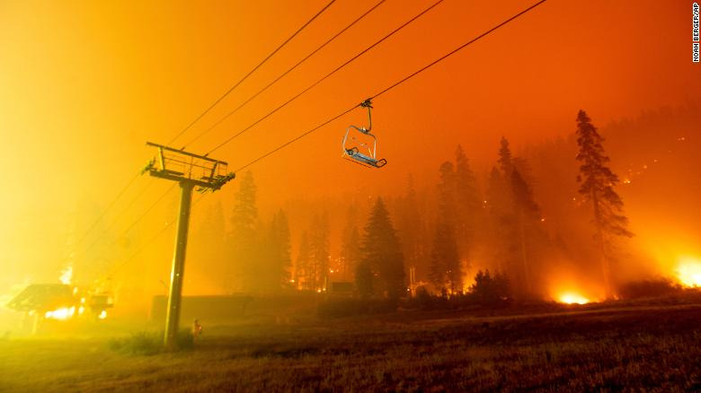

This makes me cry. This wildfire has been raging for over two weeks and is making its way into beautiful Lake Tahoe, a place that has given me so much joy and is very dear to my heart.

Every year it only seems to get worse; extreme droughts and wildfires have become so commonplace in CA that no one even talks about it anymore. And this is only one of the increasingly countless extreme weather patterns happening all over the planet. So someone please tell me that climate change isn't real. Yes, we're all eating less meat and driving EV cars and using less plastic. Yes, I want to believe we can turn this around. But honestly, I think we're already in the endgame. 😢

