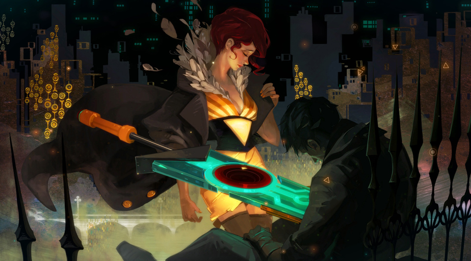

[Transistor](https://www.supergiantgames.com/games/transistor/). I am speechless. In fact, it left me crying by the end credits.

What a perfectly crafted game: the art, the gameplay, and—woah—the storytelling. Every aspect was perfect, each given its own unique treatment. Yet, they were all tied together by a dominant theme so strong the whole thing seemed almost more of an "experience" than a "game". The ending was so powerful it leaves you with that lingering feeling you get after reading a good novel. Transistor was one of the best gaming experience I’ve ever had. It will surely stick with me for a while.
